<picture>
  <source media="(prefers-color-scheme: dark)" srcset="assets/profile-dark.svg">
  <source media="(prefers-color-scheme: light)" srcset="assets/profile-light.svg">
  
</picture>

# Hi, I'm Indulger / limer

**AI Product & Full-Stack Engineer**

Building AI products, agent systems, and the full-stack infrastructure behind them.

## About Me

- I build across the **JavaScript / TypeScript** ecosystem, from React and Vue interfaces to Node.js services.
- My current focus is **AI product interaction and agent execution**: tool calls, streaming feedback, and persistent state.
- I care about the details that make a product dependable—clear API contracts, recoverable failures, and updates that stay consistent.
- Always interested in exchanging ideas about full-stack engineering, AI products, and web performance.

## Tech Stack

| Area | Technologies |
| --- | --- |
| Languages | TypeScript · JavaScript |
| Frontend | React · Vue · Next.js · Nuxt |
| Backend | Node.js · NestJS · Express · Fastify |
| Data & async work | PostgreSQL · Redis · BullMQ · SQLite |
| Delivery | Docker · Nginx |

## Previously at Xmind

Contributed to AI-assisted knowledge work and the product workflows around it:

- Multi-format content-to-mind-map conversion.
- AI Templates / Copilot and an agent inside the canvas.
- Mixpanel / GA4 instrumentation and growth workflows.

*Product snapshot from my time at Xmind.*

## Connect With Me

[GitHub @indulgers](https://github.com/indulgers)
